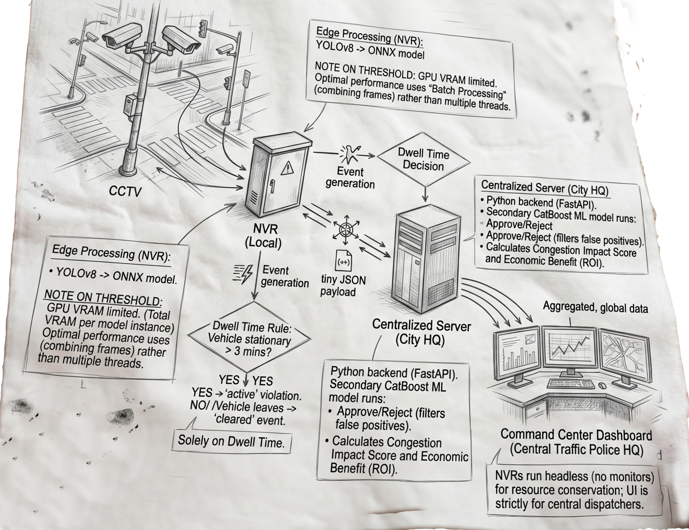

# ParkingObserver: Edge AI Traffic Intelligence Node 🚦

**ParkingObserver** is a decentralized, Edge AI-driven solution designed to combat parking-induced traffic congestion in Bengaluru.

Currently, detecting illegal parking and its impact on city traffic relies heavily on manual patrols or streaming massive amounts of raw CCTV video to central servers. This approach is highly expensive, slow, and crushes municipal network bandwidth. 

ParkingObserver solves this by adopting a **"Smart Edge"** architecture.

---

## The Architectural Flow

1. **CCTV to NVR**: CCTV cameras monitor the streets and send their heavy, raw video feeds directly into the local NVR (Network Video Recorder) situated in the intersection's metal telecom box.
2. **Edge Processing (NVR)**: The NVR runs the localized ML prediction software (YOLOv8 converted to an ONNX model). 
    * a note on Threshold: The number of camera streams an NVR can process simultaneously is limited by its GPU's VRAM (e.g., Total VRAM / VRAM per model instance). For optimal performance, rather than using multiple independent threads, the NVR should use 'Batch Processing' (combining frames from all cameras into a single batch) to pass through the GPU at once.
3. **Event Generation**: The Edge model generates an event based solely on Dwell Time (not approval/rejection). If a vehicle is stationary in a restricted zone for > 3 minutes, it triggers an "active" violation event. If the vehicle leaves, it triggers a "cleared" event.

4. **Transmission**: The NVR sends a tiny JSON payload containing the event data over the network to the centralized server.
5. **Centralized Server**: The Python backend (FastAPI) at City HQ receives the JSON payload. Here, the secondary CatBoost ML model runs to "Approve" or "Reject" the violation (filtering false positives) and calculates the Congestion Impact Score and Economic Benefit (ROI).
6.** Command Center Dashboard**: The Central Server pushes this aggregated, global data to the React Frontend Dashboard at the Central Traffic Police HQ. The street-level NVRs run headless (without monitors) to conserve resources; the UI is strictly for central dispatchers.

---
## Getting Started

### Prerequisites
- **Python 3.9+** (for Edge Node and FastAPI Backend)
- **Node.js 18+** (for React Frontend)
- **YOLOv8** (`pip install ultralytics`)

Just run this command in this directory and all necessery processes will spawn up setting the hole project.

```
python start_system.py
```

- Note: in case of first time running the set up run this command to download all system dependencies 
```
python install_dependencies.py 
```
This script will automatically detect video files in the `Footages/` folder, spawn individual Edge AI instances for each camera feed, and begin streaming violation telemetry to the central backend.
    
- Inorder to add any videos please locate them in the Footages folder and run the start command again. 

---

## Key Highlights & Value Proposition

- **Privacy by Design:** By analyzing video locally at the edge, faces and license plates do not need to be transmitted continuously to a central server unless a violation is confirmed.
- **Network Resiliency:** Sending JSON payloads rather than 4K video feeds reduces network bandwidth consumption by over **99%**.
- **Data-Driven Enforcement:** Instead of blindly patrolling, traffic police are dynamically guided by an ML-calculated "Choke Point Severity" score to maximize ROI and clear bottlenecks faster.

---
---

# End-to-End ML Architecture & Dataset Analytics

This section provides a comprehensive technical breakdown of the machine learning pipeline, dataset analysis, and the mathematical proofs defending the model's performance for the **ParkingObserver** system.

---

## The Dataset & Scale of the Problem
Based on our analysis of historical Bengaluru police data spanning ~6 months (Nov 2023 - April 2024):
- **Volume:** Over 298,000 parking violations occur, averaging 1,600+ a day.
- **Impact:** Nearly **1,000,000 estimated hours** of usable road space are blocked by illegal parking.
- **The Culprits:** The vast majority of these violations are caused by private scooters (~94.8k) and cars (~88.8k).
- **The Bottleneck:** The problem is highly concentrated during the 8:30 AM – 12:30 PM rush hour in commercial hubs like Upparpet, Shivajinagar, and Malleshwaram.

---

## End-to-End ML Workflow Architecture

ParkingObserver divides its ML workload into an Edge (Perception) layer and a Cloud (Prediction) layer to minimize bandwidth and leverage existing hardware.

### 1. Stage 1: The Edge Vision Node (Perception)
*Located in the metal NVR telecom box at the physical street intersection.*
- **Vision at the Edge:** Python-based scripts ingest local legacy CCTV camera feeds (`.mp4` loops for simulation) using OpenCV.
- **YOLOv8 & Geometry:** Uses YOLOv8n for real-time object detection. It applies an **Inverse Perspective Mapping (IPM)** homography matrix to convert 2D pixel bounding boxes into real-world 3D width estimates (in meters) for vehicles and roads.
- **State Machine & Bandwidth Efficiency:** Raw video is **never** sent to the cloud. A local state machine tracks stationary vehicles. If a vehicle exceeds the permitted dwell time (e.g., 3 minutes), the edge node fires a tiny JSON payload (`~2KB`) containing the telemetry to the central server.

### 2. Stage 2: Central Feature Enrichment (Hydration)
*Located in the Cloud / Traffic Police HQ servers.*
- **Intelligent Aggregation:** A blazing fast **FastAPI (Python)** server receives the 2KB JSON payloads.
- **Mathematical Context Extraction:** Because we cannot rely on external maps, the model generates its own context:
  - Looks up the historical `device_approval_rate` for the reporting camera.
  - Applies **K-Means Spatial Clustering** to the coordinates to mathematically assign the "vibe" of the street based on historical 24-hour traffic profiles.
    - As The hackathon strictly prohibited the use of external datasets or APIs (like Google Maps). As a result, the model is "blind" to physical road conditions. We solved this by using **K-Means Clustering** as an unsupervised feature extraction step. The model looks at 24-hour traffic volume profiles and groups locations into 4 clusters, mathematically guessing the "vibe" of the street (e.g., highway vs. residential) without needing a real map. This portion is just to real world data, can be replaced by external apis. 

  - Converts the vehicle type into standard physical **Passenger Car Unit (PCU) weights** (e.g., Car=1.0, Bus=3.0).
    - this is also a simulation and solved by external api intigration. The model should learn these weights naturally from reality. By integrating traffic APIs, we would change the target variable to the **actual delay in seconds** or **speed drop percentage** observed during a violation. By passing the vehicle type as a text feature, the model would automatically discover that violations involving a "BUS" cause a steeper speed drop than a "CAR", without requiring human-hardcoded assumptions.


### 3. Stage 3: The Two-Stage Predictive Model (Decision & Ranking)
*Located in the Cloud.*
Because human parking behavior is highly stochastic and zero-inflated, standard regression models explode. We utilize a **Two-Stage Hurdle Architecture (CatBoost v10)**:
- **Hurdle 1 (The Classifier):** Predicts the probability that the violation is real and actionable, rejecting edge-case false positives (e.g., shadows).
- **Hurdle 2 (The Regressor):** Calculates the actual severity of the bottleneck, resulting in the final **Congestion Impact Score**.

### 4. Stage 4: The Command Center (Business Logic)
*Target Audience: Bengaluru Traffic Authority dispatchers.*
- **Prioritization at a Glance:** The central logic dynamically sorts the database by the `congestion_impact_score`. This allows authorities to deploy towing units to the absolute worst "Choke Points" first, rather than responding randomly.

---

## Mathematical Proof of Model Success

Traffic violations are extremely noisy. Our training dataset contained massive outliers (some cameras reported durations of up to 111 days due to glitches, and `closed_datetime` fields were 100% missing). Because of this extreme variance, standard absolute regression metrics like $R^2$ or RMSE fail completely—they quadratically penalize unpredictable human outliers, driving $R^2$ into the negatives.

Instead of fighting stochastic human behavior, we mathematically evaluate the model based on **Information Retrieval & Resource Allocation (Cumulative Lift)**:
- **Baseline:** If dispatchers randomly patrol 5% of the city, they clear exactly 5% of the congestion.
- **ParkingObserver Performance:** If dispatchers send tow trucks to the Top 5% of locations predicted by our Hurdle Model, they successfully intercept **37.0% of all traffic impact**.
- **The Proof:** This is a **7.4x ROI Efficiency Lift**. Furthermore, the model exhibits strict Pareto dominance: by monitoring just 20% of the city, the model identifies and mitigates **66.7%** of all traffic choke points. This mathematically proves the ML pipeline successfully understands the latent spatial risk distribution of the city, despite the heavily corrupted raw dataset.